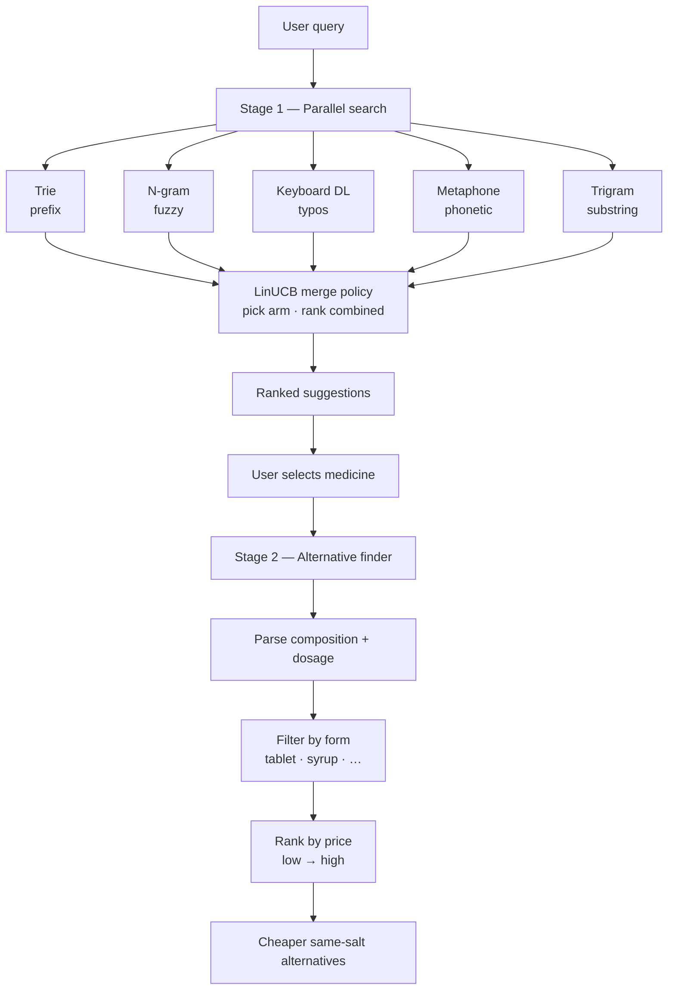
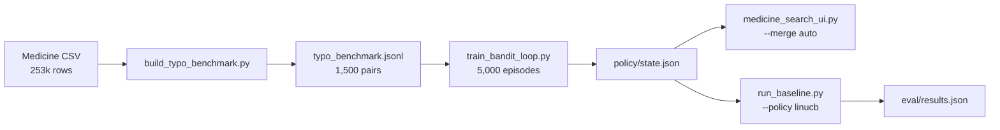

# MedSearch

**Five parallel matchers. LinUCB learns the merge. Composition index finds cheaper alternatives — across 250,000+ Indian medicines.**

MedSearch does more than autocomplete brand names. Stage 1 runs five classic string-matching structures in parallel and shows *how* each algorithm retrieved a result. A contextual bandit (LinUCB) picks the best merge weights per query — **65.3% top-1** on a 1,500-pair typo benchmark vs **60.8%** fixed merge. Stage 2 maps the selected medicine to a composition signature and surfaces cheaper same-salt, same-dose alternatives — with form filtering and price-ranked results.

---

## Highlights

| Capability | Approach |
|------------|----------|
| Autocomplete & prefix match | Trie |
| Fuzzy / approximate match | Character n-gram index + Jaccard |
| Keyboard typo correction | Damerau–Levenshtein with QWERTY-weighted cost |
| Phonetic match | Double Metaphone |
| Substring / contains search | Inverted trigram index (`*cillin*`) |
| Cheaper alternatives | Composition signature index + form filter + price sort |
| Learned merge ranking | Contextual bandit (LinUCB) over matcher outputs |

---

## How it works



**Example:** Selecting *Augmentin 625 Duo Tablet* (₹223.42) can surface tablet alternatives with the same Amoxicillin 500 mg + Clavulanic Acid 125 mg composition — including lower-priced options such as *Apcil Tablet* (₹6.98).

---

## Quick start

### Prerequisites

- Python 3.10+
- pip

### Install

```bash
cd MedSearch
pip install -r requirements-search.txt
```

### Run the web UI

```bash
python medicine_search_ui.py
```

Open [http://127.0.0.1:5000](http://127.0.0.1:5000) in your browser.

**Development shortcut** (subset of the dataset for faster index builds):

```bash
python medicine_search_ui.py --limit 5000 --no-browser
```

### CLI modules

Each search algorithm can be exercised independently:

```bash
python prefix.py
python fuzzy_n-gram.py
python key.py
python sub-string-tri.py
python double_metaphone.py
python alternatives.py
```

---

## Web UI

1. **Search** — type a medicine name; suggestions update as you type.
2. **Algorithm panels** — inspect which structure produced each hit.
3. **Select a result** — view composition, pack size, price, and form.
4. **Alternatives** — browse same-composition substitutes; toggle *Same form only*; results sorted cheapest first.

### Search tips

| Input | Best matched by |
|-------|-----------------|
| `aug` | Prefix (Trie) |
| `asprin` | Keyboard DL / Fuzzy |
| `*cillin*` | Substring (trigram) |
| Misspelled brand | Double Metaphone |

---

## API

| Endpoint | Description |
|----------|-------------|
| `GET /api/suggest?q=<query>` | Combined suggestions + per-algorithm results (LinUCB merge when policy loaded) |
| `GET /api/alternatives?name=<medicine>` | Price-ranked alternatives |
| `GET /api/health` | Index load status |

**Alternatives parameters**

| Param | Default | Description |
|-------|---------|-------------|
| `name` | — | Selected medicine name (required) |
| `limit` | `20` | Max results (cap 50) |
| `same_form` | `1` | `1` = same form only; `0` = all forms |

**Suggest parameters**

| Param | Default | Description |
|-------|---------|-------------|
| `merge` | `auto` | `auto` \| `fixed` \| `linucb` \| `balanced` |
| `debug` | `0` | `1` = include merge arm + feature vector in response |

Train policy first (`eval/train_bandit_loop.py`); live UI loads `policy/state.json` automatically.

---

## Dataset

`dataset/A_Z_medicines_dataset_of_India.csv`

| Column | Description |
|--------|-------------|
| `id` | Unique record identifier |
| `name` | Brand / product name |
| `pack_size_label` | Pack description (also used for form detection) |
| `short_composition1` | Primary active ingredient + strength |
| `short_composition2` | Secondary ingredient + strength (if combo) |
| `price` | Price in ₹ |

---

## Project structure

```
MedSearch/
├── medicine_search_ui.py    # Flask application entry point
├── search_engines.py        # Orchestrates all indexes & queries
├── alternatives.py          # Composition signature index & alternative lookup
├── prefix.py                # Trie prefix search
├── fuzzy_n-gram.py          # N-gram fuzzy search
├── key.py                   # Keyboard-aware Damerau–Levenshtein
├── sub-string-tri.py        # Trigram substring search
├── double_metaphone.py      # Phonetic search
├── policy/                  # LinUCB merge policy (features, rank, state.json)
├── eval/                    # Typo benchmark + train/eval scripts
├── paths.py                 # Shared path configuration
├── dataset/                 # Medicine CSV
├── templates/               # HTML templates
└── static/                  # CSS & JavaScript
```

Additional experimental modules (`fuzzy_bk-tree.py`, `phonetic_soundex.py`, `phonetic_metaphone.py`, `sub-string.py`) are included for standalone comparison and are not wired into the web UI by default.

---

## Architecture notes

- All indexes are built in memory at startup (first run may take several minutes on the full dataset).
- Stage 1 queries run in parallel via a thread pool (one worker per algorithm).
- Stage 2 uses an inverted index keyed by a normalized `(salt, strength)` signature derived from `short_composition1` and `short_composition2`.
- Form is inferred from `pack_size_label` and product name (tablet, capsule, syrup, injection, etc.).
- Stage 1 merge uses a **LinUCB contextual bandit** when `policy/state.json` exists; falls back to fixed priority merge otherwise.
- Strong prefix matches are pinned to the top before bandit ranking (safety rule).

---

## Automated bandit training (offline)

Oracle-labeled typo benchmark + LinUCB training loop — no UI clicks required.



### Full-dataset workflow (recommended)

```bash
pip install -r requirements-search.txt

python eval/build_typo_benchmark.py
python eval/train_bandit_loop.py --episodes 5000 --fresh
python eval/run_baseline.py --policy linucb
```

- Indexes all **253,973** medicines (omit `--limit`).
- Benchmark: **1,500** auto-generated typo pairs (`eval/typo_benchmark.jsonl`).
- Trained policy saved to `policy/state.json` (gitignored; regenerate locally).
- Live UI loads policy automatically with `--merge auto` (default).

### Dev subset (faster)

```bash
python eval/build_typo_benchmark.py --limit 5000
python eval/train_bandit_loop.py --limit 5000 --episodes 2000 --fresh
```

### Eval results (full catalog, 1,500-pair benchmark)

Trained with **5,000** LinUCB episodes on the full medicine index:

| Metric | Fixed merge | LinUCB | Δ |
|--------|-------------|--------|---|
| Top-1 accuracy | 60.8% | **65.3%** | **+4.5 pts** |
| Top-3 accuracy | 77.1% | **85.6%** | +8.5 pts |
| MRR | 70.1% | **76.6%** | +6.5 pts |

Most-used merge arms at eval: `keyboard_boost`, `balanced`, `prefix_boost`, `metaphone_boost`.

See [`eval/README.md`](eval/README.md) for script details. Full metrics: `eval/results.json`.

---

## Disclaimer

MedSearch is an academic / demonstration project. Alternative medicine suggestions are matched on dataset composition and strength fields only. **Always consult a qualified pharmacist or physician before substituting medicines.**

---

## License

This project is intended for educational use. Dataset rights remain with the original source.
